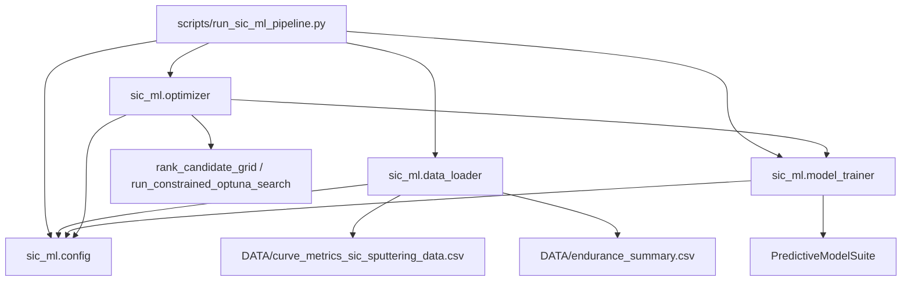
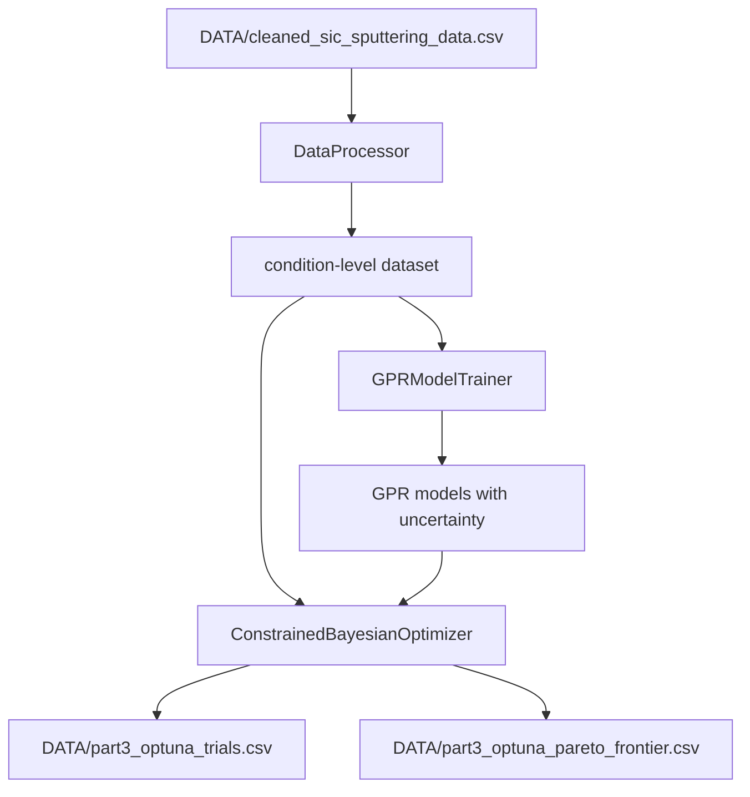
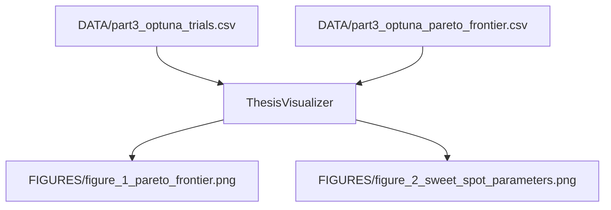
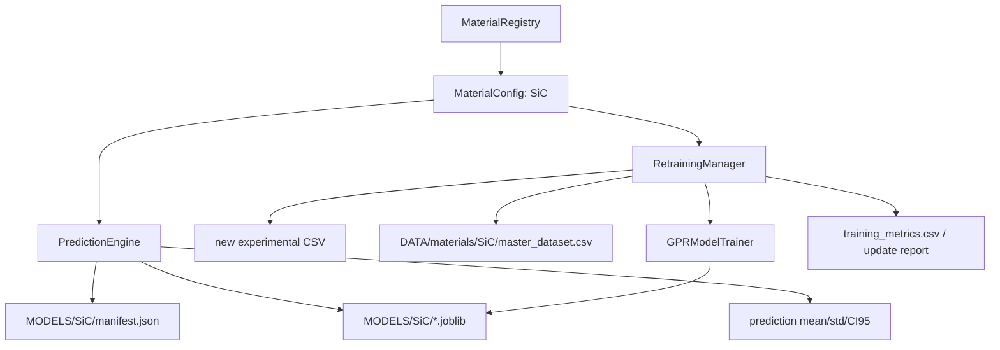
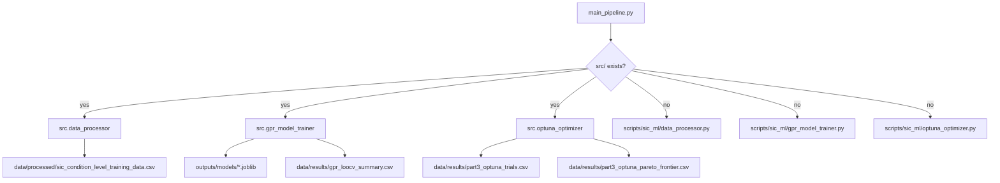
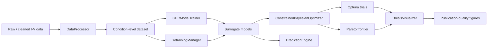

# SiC RRAM ML 專案工作流與架構整理

## 1. 文件目的

本文件整理目前 SiC 薄膜電阻式記憶體 (RRAM) 機器學習專案的完整工作流、現有資料夾結構、重構目標架構，以及各 Python 模組之間的引用關係。

目前專案正處於「從研究型腳本升級為 MLOps 架構」的過渡階段，因此本文同時區分：

- **現況架構**：目前 workspace 內實際存在的目錄與模組。
- **目標架構**：下一步預計搬移到 `src/`, `data/`, `outputs/` 的標準化 MLOps 架構。
- **過渡入口**：根目錄的 `main_pipeline.py` 已先建立，可在正式搬檔前使用 legacy fallback。

## 2. 專案目標摘要

本專案主題為：

> 以機器學習輔助濺射製程最佳化之可行性研究：以碳化矽 (SiC) 為例

核心任務包含：

- 從實驗 I-V curve 資料萃取 condition-level ML dataset。
- 使用 Gaussian Process Regression (GPR) 建立小樣本材料實驗 surrogate model。
- 使用 Optuna 執行 constrained multi-objective Bayesian optimization。
- 產生論文級圖表與可匯入個人知識庫的 Markdown 報告。
- 擴展為支援多材料、多模型、可重訓的預測系統。

## 3. 目前實際資料夾結構

截至目前，workspace 根目錄位於：

```text
D:/Codex/ML/SiC
```

目前主要結構如下：

```text
SiC/
├── .codex_deps/
│   └── 本地補充套件，例如 optuna, pypdf 等
├── DATA/
│   ├── cleaned_sic_sputtering_data.csv
│   ├── curve_metrics_sic_sputtering_data.csv
│   ├── condition_metric_summary.csv
│   ├── endurance_summary.csv
│   ├── source_file_parse_summary.csv
│   ├── sweet_spot_ranking.csv
│   ├── ml_condition_level_dataset.csv
│   ├── ml_loco_cv_predictions.csv
│   ├── ml_loco_cv_summary.csv
│   ├── ml_classifier_training_summary.csv
│   ├── ml_candidate_grid_predictions.csv
│   ├── ml_optuna_trials.csv
│   ├── part3_optuna_trials.csv
│   ├── part3_optuna_pareto_frontier.csv
│   └── materials/
│       └── SiC/
│           └── master_dataset.csv
├── FIGURES/
│   ├── figure_1_pareto_frontier.png
│   └── figure_2_sweet_spot_parameters.png
├── MODELS/
│   └── SiC/
│       ├── Forming_Voltage_V.joblib
│       ├── Operation_Voltage_V.joblib
│       ├── Leakage_Current_A.joblib
│       ├── On_Off_Ratio.joblib
│       ├── Endurance_Cycles.joblib
│       ├── manifest.json
│       └── training_metrics.csv
├── REPORTS/
│   ├── forming_voltage_analysis.md
│   ├── on_off_ratio_analysis.md
│   ├── leakage_current_analysis.md
│   ├── endurance_analysis.md
│   ├── conduction_mechanism_analysis.md
│   ├── ml_architecture_blueprint.md
│   ├── ml_model_validation_report.md
│   ├── ml_optimization_report.md
│   └── project_workflow_architecture.md
├── scripts/
│   ├── run_sic_ml_pipeline.py
│   └── sic_ml/
│       ├── __init__.py
│       ├── config.py
│       ├── data_loader.py
│       ├── data_processor.py
│       ├── model_trainer.py
│       ├── gpr_model_trainer.py
│       ├── optimizer.py
│       ├── optuna_optimizer.py
│       ├── thesis_visualizer.py
│       └── material_prediction_system.py
├── main_pipeline.py
└── M1003101碩論.pdf
```

## 4. 目標 MLOps 架構

下一步重構後，建議目錄如下：

```text
SiC/
├── data/
│   ├── raw/
│   │   └── 原始 CSV / Excel / TXT / PDF metadata
│   ├── processed/
│   │   ├── cleaned_sic_sputtering_data.csv
│   │   └── sic_condition_level_training_data.csv
│   └── results/
│       ├── gpr_loocv_summary.csv
│       ├── gpr_loocv_predictions.csv
│       ├── part3_optuna_trials.csv
│       └── part3_optuna_pareto_frontier.csv
├── src/
│   ├── __init__.py
│   ├── data_processor.py
│   ├── gpr_model_trainer.py
│   ├── optuna_optimizer.py
│   ├── thesis_visualizer.py
│   └── material_prediction_system.py
├── outputs/
│   ├── figures/
│   │   ├── figure_1_pareto_frontier.png
│   │   └── figure_2_sweet_spot_parameters.png
│   └── models/
│       ├── Forming_Voltage_V.joblib
│       ├── Operation_Voltage_V.joblib
│       ├── Leakage_Current_A.joblib
│       ├── On_Off_Ratio.joblib
│       └── Endurance_Cycles.joblib
├── reports/
│   └── 或保留 REPORTS/，視論文文件管理習慣決定
├── main_pipeline.py
└── README.md
```

## 5. 完整工作流

### 5.1 Phase 0: 文獻與製程背景

輸入：

- `M1003101碩論.pdf`
- 研究背景：SiC RRAM、RF sputtering、RTA、Forming、On/Off ratio、leakage、endurance、conduction mechanism。

輸出：

- 分析時採用的 domain constraints：
  - `No RTA` 以 `RTA_Temperature_C = 25` 表示。
  - 額外加入 `Has_RTA` 區分未退火與已退火。
  - `On_Off_Ratio >= 5`。
  - `Operation_Voltage_V <= 3 V`。

### 5.2 Phase 1: ETL 與電性指標萃取

主要輸入：

```text
DATA/cleaned_sic_sputtering_data.csv
```

目前核心模組：

```text
scripts/sic_ml/data_processor.py
```

主要 Class：

```text
DataProcessor
```

主要步驟：

1. 讀取 row-level I-V curve data。
2. 檢查必要欄位，例如：
   - `curve_id`
   - `measurement_type`
   - `rf_power_w`
   - `process_time_min`
   - `rta_temp_c`
   - `rta_condition`
   - `voltage_v`
   - `current_a`
   - `abs_current_a`
   - `is_valid_point`
3. 建立工程化特徵：
   - `RF_Power_W`
   - `Process_Time_Min`
   - `RTA_Temperature_C`
   - `Has_RTA`
4. 將 No RTA 轉換為：

```text
RTA_Temperature_C = 25
Has_RTA = 0
```

5. 由 curve-level 資訊估計 condition-level target：
   - `Forming_Voltage_V`
   - `Operation_Voltage_V`
   - `Leakage_Current_A`
   - `On_Off_Ratio`
   - `Endurance_Cycles`
6. 產生輔助 log feature：
   - `Leakage_Current_Log10`
   - `On_Off_Log10`

目前輸出：

```text
DATA/materials/SiC/master_dataset.csv
```

重構後建議輸出：

```text
data/processed/sic_condition_level_training_data.csv
```

### 5.3 Phase 2: GPR 小樣本預測模型

目前核心模組：

```text
scripts/sic_ml/gpr_model_trainer.py
```

主要 Class：

```text
GPRModelTrainer
```

模型設計：

- 使用 `GaussianProcessRegressor`。
- 使用 `StandardScaler` 對輸入特徵縮放。
- Kernel 採用：
  - `Matern`
  - 可選 `RBF`
  - 加入 `WhiteKernel` 表示實驗雜訊。
- `alpha = 1e-2`，提升小樣本下的 regularization。
- 使用 `LeaveOneOut` cross-validation，符合 N 約 17 的小樣本情境。

Target transformation：

| Target | Transformation | 理由 |
|---|---|---|
| `Forming_Voltage_V` | `none` | 電壓尺度相對穩定 |
| `Operation_Voltage_V` | `none` | 電壓尺度相對穩定 |
| `Leakage_Current_A` | `log10` | 漏電流跨多個數量級 |
| `On_Off_Ratio` | `log10` | 比值通常呈現 log-like 分佈 |
| `Endurance_Cycles` | `log1p` | 循環次數為非負且偏態 |

重要輸出：

```text
MODELS/SiC/*.joblib
MODELS/SiC/training_metrics.csv
```

重構後建議輸出：

```text
outputs/models/*.joblib
data/results/gpr_loocv_summary.csv
data/results/gpr_loocv_predictions.csv
```

### 5.4 Phase 3: Constrained Bayesian Optimization

目前核心模組：

```text
scripts/sic_ml/optuna_optimizer.py
```

主要 Class：

```text
ConstrainedBayesianOptimizer
```

搜尋空間：

| 參數 | 空間 |
|---|---|
| `RF_Power` | 50 到 75，step 25 |
| `Process_Time` | 30 到 120，step 30 |
| `RTA_Temperature` | `[25, 400, 500]` |
| `Has_RTA` | 由 RTA temperature 推得，25 對應 0，其餘對應 1 |

優化目標：

```text
Objective 1: minimize Leakage_Current_A
Objective 2: maximize Endurance_Cycles
```

硬性約束：

```text
g1(X) = 5 - On_Off_Ratio(X) <= 0
g2(X) = Operation_Voltage_V(X) - 3 <= 0
```

目前輸出：

```text
DATA/part3_optuna_trials.csv
DATA/part3_optuna_pareto_frontier.csv
```

重構後建議輸出：

```text
data/results/part3_optuna_trials.csv
data/results/part3_optuna_pareto_frontier.csv
```

### 5.5 Phase 4: 論文級視覺化

目前核心模組：

```text
scripts/sic_ml/thesis_visualizer.py
```

主要 Class：

```text
ThesisVisualizer
```

輸入：

```text
DATA/part3_optuna_trials.csv
DATA/part3_optuna_pareto_frontier.csv
```

輸出：

```text
FIGURES/figure_1_pareto_frontier.png
FIGURES/figure_2_sweet_spot_parameters.png
```

重構後建議輸入與輸出：

```text
data/results/part3_optuna_trials.csv
data/results/part3_optuna_pareto_frontier.csv
outputs/figures/figure_1_pareto_frontier.png
outputs/figures/figure_2_sweet_spot_parameters.png
```

### 5.6 Phase 5: 多材料預測與重訓系統

目前核心模組：

```text
scripts/sic_ml/material_prediction_system.py
```

主要 Class / Dataclass：

```text
ConstraintSpec
MaterialConfig
MaterialRegistry
PredictionEngine
RetrainingManager
```

功能：

- 使用 `MaterialConfig` 註冊不同材料的 metadata。
- 使用 `MaterialRegistry.with_default_sic()` 建立 SiC 預設材料設定。
- 使用 `PredictionEngine.predict()` 載入 GPR 模型並回傳：
  - Mean
  - Std
  - 95% CI
  - Extrapolation warning
- 使用 `RetrainingManager.retrain_from_new_csv()`：
  - 驗證新 CSV 欄位。
  - 備份舊 master dataset。
  - append 新資料。
  - 重新訓練 GPR。
  - 輸出更新報告。

目前模型與資料位置：

```text
DATA/materials/SiC/master_dataset.csv
MODELS/SiC/*.joblib
MODELS/SiC/manifest.json
MODELS/SiC/training_metrics.csv
```

重構後建議：

```text
data/processed/materials/SiC/master_dataset.csv
outputs/models/SiC/*.joblib
outputs/models/SiC/manifest.json
outputs/models/SiC/training_metrics.csv
```

### 5.7 Phase 6: Explainable AI 預備位置

Phase 6 尚未實作。建議後續新增：

```text
src/xai_explainer.py
outputs/figures/xai/
reports/xai/
```

建議分析項目：

- Permutation importance。
- SHAP 或 model-agnostic sensitivity analysis。
- GPR posterior uncertainty map。
- Process parameter partial dependence / response surface。
- Feature interaction：`RF_Power_W x RTA_Temperature_C`, `Process_Time_Min x Has_RTA`。

## 6. 模組引用關係

### 6.1 現況 legacy pipeline



用途：

- 這是較早期的一體化研究 pipeline。
- 可輸出 `ml_condition_level_dataset.csv`, `ml_loco_cv_summary.csv`, `ml_candidate_grid_predictions.csv`, `ml_optuna_trials.csv`。
- 包含 regression 與 conduction mechanism classification。

### 6.2 Part 1 到 Part 3 的新版 ML pipeline



對應模組：

```text
data_processor.py -> gpr_model_trainer.py -> optuna_optimizer.py
```

目前引用：

```text
gpr_model_trainer.py imports sic_ml.data_processor.DataProcessor
optuna_optimizer.py imports sic_ml.data_processor.DataProcessor
optuna_optimizer.py imports sic_ml.gpr_model_trainer.GPRModelTrainer
```

重構後建議引用：

```python
from .data_processor import DataProcessor
from .gpr_model_trainer import GPRModelTrainer
```

### 6.3 視覺化 pipeline



目前引用：

- `thesis_visualizer.py` 不依賴其他內部模組。
- 它直接讀取 Optuna 輸出的 CSV。

重構後建議：

- 將預設輸入改為 `data/results/`。
- 將預設輸出改為 `outputs/figures/`。

### 6.4 Phase 5 多材料預測與重訓 pipeline



目前引用：

```text
material_prediction_system.py imports sic_ml.data_processor.DataProcessor
material_prediction_system.py imports sic_ml.gpr_model_trainer.GPRModelTrainer
```

重構後建議引用：

```python
from .data_processor import DataProcessor
from .gpr_model_trainer import GPRModelTrainer
```

### 6.5 新增根目錄 main pipeline

目前新增：

```text
main_pipeline.py
```

設計目的：

- 作為資料前處理、GPR 訓練、Optuna 最佳化的單一入口。
- 優先 import `src/`。
- 若尚未搬檔，暫時 fallback 到 `scripts/sic_ml/`。

引用邏輯：



## 7. 資料流總覽



## 8. 主要模組職責表

| 模組 | 目前路徑 | 主要角色 | 主要輸入 | 主要輸出 |
|---|---|---|---|---|
| `config.py` | `scripts/sic_ml/config.py` | legacy 常數集中管理 | 無 | `DATA_DIR`, constraints, target names |
| `data_loader.py` | `scripts/sic_ml/data_loader.py` | legacy condition dataset builder | curve metrics, endurance summary | condition-level dataset |
| `model_trainer.py` | `scripts/sic_ml/model_trainer.py` | legacy GPR + SVC model suite | condition-level dataset | regression / classification predictions |
| `optimizer.py` | `scripts/sic_ml/optimizer.py` | legacy grid ranking + single-objective Optuna | `PredictiveModelSuite` | ranked recipes / trials |
| `data_processor.py` | `scripts/sic_ml/data_processor.py` | Part 1 ETL / feature engineering | cleaned I-V row-level CSV | condition-level dataset |
| `gpr_model_trainer.py` | `scripts/sic_ml/gpr_model_trainer.py` | Part 2 GPR + LOOCV + uncertainty | condition-level dataset | trained GPR / CV metrics / CI |
| `optuna_optimizer.py` | `scripts/sic_ml/optuna_optimizer.py` | Part 3 constrained multi-objective optimization | condition-level dataset | Optuna trials / Pareto frontier |
| `thesis_visualizer.py` | `scripts/sic_ml/thesis_visualizer.py` | Part 4 publication-quality figures | Optuna trials / Pareto frontier | PNG figures |
| `material_prediction_system.py` | `scripts/sic_ml/material_prediction_system.py` | Phase 5 multi-material inference / retraining | material config, new CSV, models | prediction table / retrained models / report |
| `main_pipeline.py` | root | 重構後單一入口 | cleaned CSV | processed data / models / results |

## 9. 路徑重構清單

### 9.1 必改路徑

| 原路徑 | 新路徑 | 說明 |
|---|---|---|
| `DATA/cleaned_sic_sputtering_data.csv` | `data/processed/cleaned_sic_sputtering_data.csv` | cleaned I-V input |
| `DATA/part3_optuna_trials.csv` | `data/results/part3_optuna_trials.csv` | Optuna 全部 trial |
| `DATA/part3_optuna_pareto_frontier.csv` | `data/results/part3_optuna_pareto_frontier.csv` | Pareto frontier |
| `FIGURES/*.png` | `outputs/figures/*.png` | 論文圖 |
| `MODELS/SiC/*.joblib` | `outputs/models/SiC/*.joblib` | 多材料模型 |
| `DATA/materials/SiC/master_dataset.csv` | `data/processed/materials/SiC/master_dataset.csv` | retraining master dataset |

### 9.2 import 重構

目前多個模組使用：

```python
from sic_ml.data_processor import DataProcessor
from sic_ml.gpr_model_trainer import GPRModelTrainer
```

搬到 `src/` 後建議改為：

```python
from .data_processor import DataProcessor
from .gpr_model_trainer import GPRModelTrainer
```

根目錄 `main_pipeline.py` 使用：

```python
from src.data_processor import DataProcessor
from src.gpr_model_trainer import GPRModelTrainer
from src.optuna_optimizer import ConstrainedBayesianOptimizer
```

## 10. 執行方式

### 10.1 目前 legacy pipeline

```powershell
python .\scripts\run_sic_ml_pipeline.py --n-trials 80
```

用途：

- 使用 `data_loader.py`, `model_trainer.py`, `optimizer.py` 的早期 pipeline。
- 輸出到 `DATA/` 與 `REPORTS/`。

### 10.2 Part 1 到 Part 3 新版 pipeline

搬檔後建議執行：

```powershell
python .\main_pipeline.py --cleaned-data .\data\processed\cleaned_sic_sputtering_data.csv --n-trials 100
```

目前尚未搬檔前，`main_pipeline.py` 會 fallback 到：

```text
scripts/sic_ml/
```

並暫時讀取：

```text
DATA/cleaned_sic_sputtering_data.csv
```

### 10.3 視覺化

目前：

```powershell
python .\scripts\sic_ml\thesis_visualizer.py
```

重構後建議讓 visualizer 讀取：

```text
data/results/part3_optuna_trials.csv
data/results/part3_optuna_pareto_frontier.csv
```

並輸出：

```text
outputs/figures/
```

### 10.4 多材料預測與重訓

目前可使用：

```powershell
python .\scripts\sic_ml\material_prediction_system.py
```

未來建議新增 CLI 或 API wrapper：

```text
src/material_prediction_system.py
app.py 或 api_server.py
```

## 11. 已知技術債與重構注意事項

### 11.1 路徑硬編碼

目前以下模組仍有 legacy 路徑：

- `config.py`: `DATA`, `REPORTS`, `MODELS`
- `data_processor.py`: `DATA/cleaned_sic_sputtering_data.csv`
- `optuna_optimizer.py`: `PROJECT_ROOT / "DATA"`
- `thesis_visualizer.py`: `DATA`, `FIGURES`
- `material_prediction_system.py`: `DATA`, `REPORTS`, `MODELS`

建議做法：

- 建立 `src/paths.py` 或 `src/project_paths.py`。
- 將所有輸入輸出路徑集中管理。
- 模組本身不直接假設根目錄位置，改由 `main_pipeline.py` 或 config 注入。

### 11.2 sys.path bootstrap

目前部分模組為了直接執行，手動修改 `sys.path`。

重構後建議：

- 核心模組移除 `sys.path` 修改。
- 使用 package relative import。
- CLI 行為集中到 `main_pipeline.py` 或 `scripts/cli_*.py`。

### 11.3 demo block

目前多個檔案底部有：

```python
if __name__ == "__main__":
    ...
```

重構後建議：

- 核心模組保留純 Class / Function。
- 測試或 demo 移到：

```text
examples/
tests/
main_pipeline.py
```

### 11.4 模組命名分層

目前同時存在：

- `model_trainer.py`
- `gpr_model_trainer.py`
- `optimizer.py`
- `optuna_optimizer.py`

建議定義層級：

- `model_trainer.py`：若保留，作為通用多 target model suite。
- `gpr_model_trainer.py`：作為小樣本 GPR surrogate 專用模型。
- `optimizer.py`：若保留，作為 scoring/grid search utilities。
- `optuna_optimizer.py`：作為 constrained Bayesian optimization 專用模組。

若未來只維護一條 pipeline，建議將 legacy 的 `model_trainer.py` 與 `optimizer.py` 移到 `archive/legacy/`。

## 12. 下一步建議

建議按以下順序重構：

1. 建立 `data/raw/`, `data/processed/`, `data/results/`, `src/`, `outputs/figures/`, `outputs/models/`。
2. 將 `scripts/sic_ml/data_processor.py`, `gpr_model_trainer.py`, `optuna_optimizer.py` 搬到 `src/`。
3. 在 `src/` 新增 `__init__.py`。
4. 將三個核心模組 import 改為 relative import。
5. 將舊 `DATA/cleaned_sic_sputtering_data.csv` 複製或搬移到 `data/processed/cleaned_sic_sputtering_data.csv`。
6. 執行：

```powershell
python .\main_pipeline.py --n-trials 100
```

7. 再將 `thesis_visualizer.py` 與 `material_prediction_system.py` 接上新路徑。
8. 進入 Phase 6：新增 `src/xai_explainer.py`，輸出 XAI 圖表與材料科學解釋報告。
