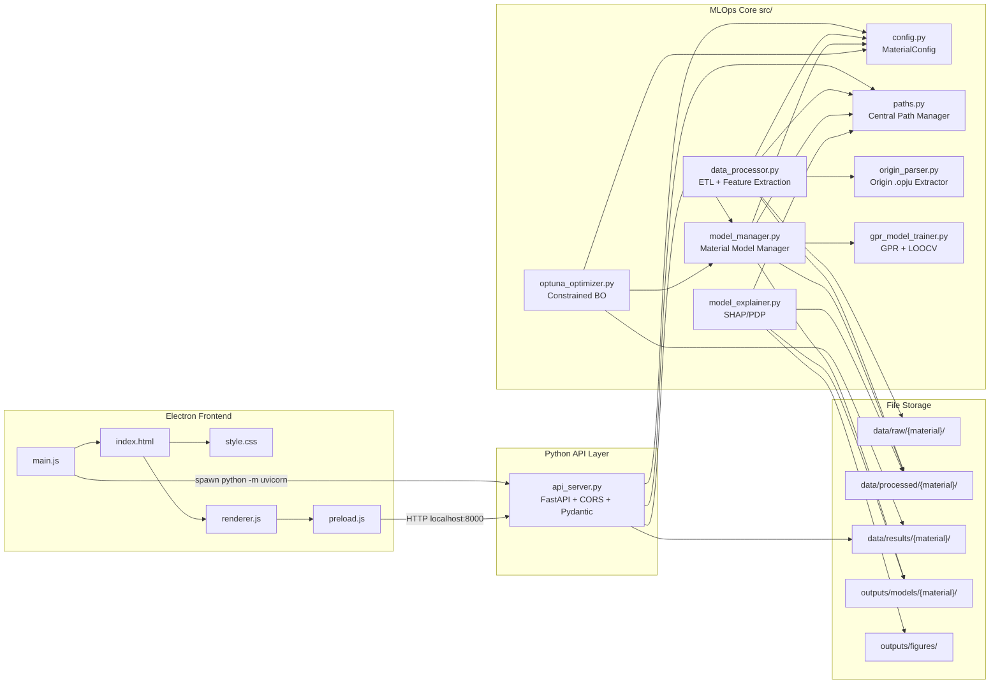
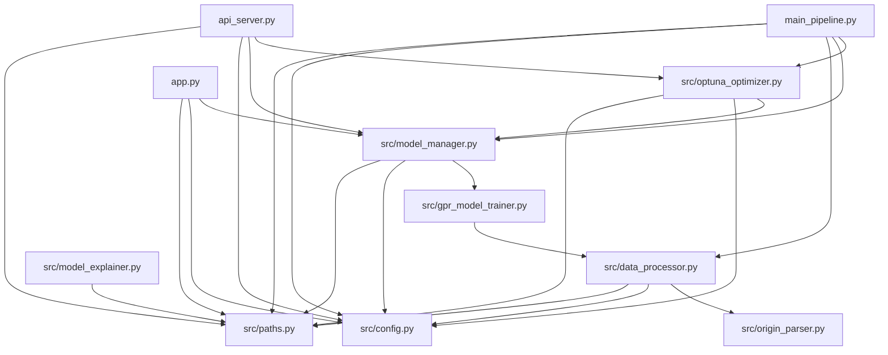
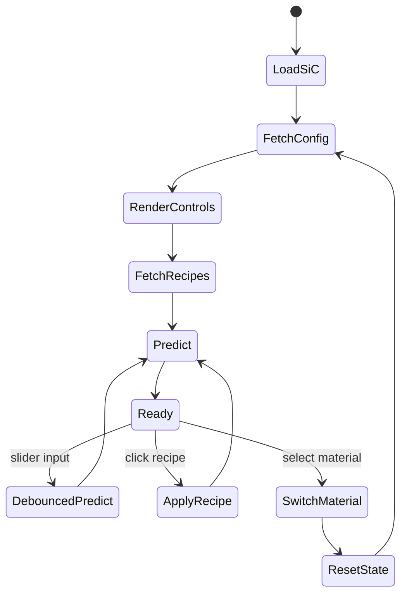

# TRR: Technical Readiness Review

更新日期: 2026-04-15  
專案根目錄: `D:/Codex/ML/SiC`  
目前階段: Phase 13 - Electron + FastAPI + Multi-Material MLOps GUI

---

## 1. Executive Summary

本專案已從單一 SiC RRAM 資料分析腳本，演進為支援多材料的 MLOps 系統。核心後端以 `src/` 作為 Python 模組層，透過 `src.config.MaterialConfig` 管理 SiC 與 NiO 的材料特徵、預測目標、搜尋空間與最佳化約束。

目前展示層同時保留兩條路徑：

- Streamlit legacy GUI: `app.py`
- Electron production GUI: `main.js` + `preload.js` + `index.html` + `style.css` + `renderer.js`

Python FastAPI 後端 `api_server.py` 作為 Electron 與材料模型之間的 RESTful API bridge。Electron 主進程會在應用啟動時以子進程方式啟動 Uvicorn，Renderer 透過 `preload.js` 暴露的 `window.api` 安全呼叫 FastAPI。

---

## 2. Current Folder Structure

以下結構排除 `.git/`、`.codex_deps/`、`__pycache__/` 等環境與快取資料夾。

```text
SiC/
├── api_server.py
├── app.py
├── index.html
├── main.js
├── main_pipeline.py
├── package.json
├── preload.js
├── README.MD
├── renderer.js
├── setup_project.py
├── style.css
├── TRR.md
├── M1003101碩論.pdf
├── configs/
├── src/
│   ├── __init__.py
│   ├── config.py
│   ├── data_processor.py
│   ├── gpr_model_trainer.py
│   ├── model_explainer.py
│   ├── model_manager.py
│   ├── optuna_optimizer.py
│   ├── origin_parser.py
│   └── paths.py
├── data/
│   ├── raw/
│   │   ├── SiC/
│   │   └── NiO/
│   │       ├── *.opju
│   │       ├── *.xlsx
│   │       ├── *.docx
│   │       └── *.pptx
│   ├── processed/
│   │   ├── SiC/
│   │   ├── NiO/
│   │   │   ├── cleaned_nio_data.csv
│   │   │   ├── nio_condition_level_dataset.csv
│   │   │   └── nio_etl_file_report.csv
│   │   └── sic_condition_level_training_data.csv
│   ├── results/
│   │   ├── SiC/
│   │   ├── NiO/
│   │   ├── gpr_loocv_summary.csv
│   │   ├── gpr_loocv_predictions.csv
│   │   ├── part3_optuna_trials.csv
│   │   ├── part3_optuna_pareto_frontier.csv
│   │   ├── xai_pdp_values_Leakage_Current_A.csv
│   │   └── xai_pdp_values_Endurance_Cycles.csv
│   └── materials/
│       └── SiC/
│           └── master_dataset.csv
├── outputs/
│   ├── figures/
│   │   ├── xai_shap_summary_Leakage_Current_A.png
│   │   ├── xai_shap_summary_Endurance_Cycles.png
│   │   ├── xai_pdp_Leakage_Current_A.png
│   │   └── xai_pdp_Endurance_Cycles.png
│   └── models/
│       ├── SiC/
│       ├── NiO/
│       │   ├── Forming_Voltage_V.joblib
│       │   ├── Operation_Voltage_V.joblib
│       │   ├── Leakage_Current_A.joblib
│       │   ├── On_Off_Ratio.joblib
│       │   ├── manifest.json
│       │   └── training_metrics.csv
│       ├── Forming_Voltage_V.joblib
│       ├── Operation_Voltage_V.joblib
│       ├── Leakage_Current_A.joblib
│       ├── On_Off_Ratio.joblib
│       └── Endurance_Cycles.joblib
├── REPORTS/
│   ├── conduction_mechanism_analysis.md
│   ├── endurance_analysis.md
│   ├── forming_voltage_analysis.md
│   ├── leakage_current_analysis.md
│   ├── ml_architecture_blueprint.md
│   ├── ml_model_validation_report.md
│   ├── ml_optimization_report.md
│   ├── on_off_ratio_analysis.md
│   └── project_workflow_architecture.md
├── archive/
│   └── legacy/
│       ├── app_before_phase10.py
│       ├── main_pipeline_before_phase8_5.py
│       ├── main_pipeline_before_phase9_5.py
│       ├── TRR_before_phase8_5.md
│       ├── src_before_phase8_5/
│       ├── src_before_phase9/
│       └── scripts/
├── scripts/
│   └── sic_ml/
├── DATA/
├── FIGURES/
├── MODELS/
└── Generalizable ML-Assisted Platform for Semiconductor Materials/
```

### 2.1 Case-Sensitivity Note

在目前 Windows 工作區中，`data/` 可能顯示為 `DATA/`，因為 Windows filesystem 預設大小寫不敏感。程式碼層以 `src.paths.DATA_DIR = PROJECT_ROOT / "data"` 為 canonical path。若未來搬到 Linux/macOS case-sensitive 環境，建議整理成單一小寫 `data/`、`outputs/`，並逐步移除 legacy `DATA/`、`FIGURES/`、`MODELS/`。

---

## 3. High-Level Architecture



---

## 4. Runtime Workflows

### 4.1 End-to-End CLI Pipeline

```text
main_pipeline.py
    -> argparse parses --material, --n-trials, --skip-etl
    -> DataProcessor(material_name)
        -> clean_raw_data()
        -> build_condition_level_dataset()
    -> MaterialModelManager(material_name)
        -> train_all_targets()
        -> outputs/models/{material}/
    -> ConstrainedBayesianOptimizer(material_name)
        -> optimize(n_trials)
        -> data/results/{material}/part3_optuna_trials.csv
        -> data/results/{material}/part3_optuna_pareto_frontier.csv
```

### 4.2 Electron Desktop App Flow

```text
package.json
    -> npm start maps to electron .
    -> main.js
        -> spawn("python", ["-m", "uvicorn", "api_server:app", "--host", "127.0.0.1", "--port", "8000"])
        -> BrowserWindow loads index.html
    -> preload.js
        -> contextBridge exposes window.api
    -> renderer.js
        -> GET /api/config/{material}
        -> GET /api/recipes/{material}
        -> POST /api/predict/{material}
```

### 4.3 FastAPI Request Flow

```text
Electron Renderer
    -> preload.js request()
    -> api_server.py
        GET /api/config/{material_name}
            -> src.config.get_material_config()
            -> src.paths material path helpers

        POST /api/predict/{material_name}
            -> Pydantic PredictionRequest
            -> MaterialModelManager.load_models(strict=False)
            -> MaterialModelManager.predict(features)
            -> returns mean/std/ci95_low/ci95_high

        GET /api/recipes/{material_name}
            -> data/results/{material}/part3_optuna_pareto_frontier.csv
            -> fallback trials CSV and legacy SiC CSVs
            -> returns ultra-low leakage, high secondary objective, balanced sweet spot
```

### 4.4 XAI Workflow

```text
src/model_explainer.py
    -> load processed condition-level dataset
    -> load GPR models or surrogate RF explainer
    -> generate SHAP-style summary plots
    -> generate Partial Dependence Plots
    -> outputs/figures/*.png
```

---

## 5. Module Responsibility Matrix

| Module | Role | Key Inputs | Key Outputs |
|---|---|---|---|
| `src/config.py` | Centralized material metadata | Hardcoded SiC/NiO configs | `MaterialConfig`, search spaces, constraints |
| `src/paths.py` | Central path registry | Project root | Canonical raw/processed/results/models paths |
| `src/data_processor.py` | ETL and feature extraction | `data/raw/{material}/`, `MaterialConfig` | `cleaned_{material}_data.csv`, condition-level dataset |
| `src/origin_parser.py` | Origin `.opju` extraction | `.opju` files, Origin COM | `_extracted_from_origin.csv` |
| `src/gpr_model_trainer.py` | Single-target GPR trainer | Dataframe X/y | GPR model, LOOCV metrics, uncertainty prediction |
| `src/model_manager.py` | Multi-material model orchestration | `MaterialConfig`, processed dataset | `.joblib` models, `manifest.json`, `training_metrics.csv` |
| `src/optuna_optimizer.py` | Material-aware constrained optimization | Model manager, search space, constraints | Optuna trials CSV, Pareto frontier CSV |
| `src/model_explainer.py` | XAI visualization | Models and processed data | SHAP/PDP figures |
| `api_server.py` | REST API bridge | HTTP JSON | Config, predictions, recipes |
| `main_pipeline.py` | CLI orchestration | CLI args | ETL, training, optimization side effects |
| `app.py` | Streamlit legacy GUI | Streamlit widgets, models, CSVs | Web dashboard |
| `main.js` | Electron main process | Electron lifecycle | BrowserWindow, Python backend child process |
| `preload.js` | Secure renderer bridge | Electron contextBridge | `window.api` |
| `renderer.js` | Frontend state and API logic | `window.api`, DOM | Dynamic controls, metrics, recipes |
| `style.css` | Apple-style UI | HTML classes | Glass sidebar, cards, sliders, responsive layout |
| `index.html` | Electron UI skeleton | CSS and JS | Sidebar, dashboard, metric containers |

---

## 6. Python Dependency Relationships



### 6.1 External Python Libraries

| Area | Libraries |
|---|---|
| Data processing | `pandas`, `numpy`, `openpyxl` through pandas Excel support |
| ML modeling | `scikit-learn`, `joblib`, `scipy` |
| Optimization | `optuna` |
| Visualization | `matplotlib`, `seaborn` |
| API | `fastapi`, `uvicorn`, `pydantic`, `starlette` |
| Legacy GUI | `streamlit` |
| Origin automation | `originpro`, Windows COM through Origin |

### 6.2 Node/Electron Dependencies

| File | Dependency |
|---|---|
| `package.json` | `electron` dev dependency |
| `main.js` | `electron`, Node `path`, Node `child_process` |
| `preload.js` | `electron.contextBridge`, browser `fetch` |
| `renderer.js` | DOM APIs, `window.api`, browser `fetch` fallback |

---

## 7. Material Configuration Snapshot

### 7.1 SiC

| Field | Value |
|---|---|
| Material | `SiC` |
| Features | `RF_Power_W`, `Process_Time_Min`, `RTA_Temperature_C`, `Has_RTA` |
| Targets | `Forming_Voltage_V`, `Operation_Voltage_V`, `Leakage_Current_A`, `On_Off_Ratio`, `Endurance_Cycles` |
| Search space | RF 50-75 W, time 30-120 min, RTA `[25, 400, 500]` |
| Constraints | `On_Off_Ratio >= 5`, `Operation_Voltage_V <= 3` |
| On/Off read mode | Fixed read voltage, default `0.1 V` |

### 7.2 NiO

| Field | Value |
|---|---|
| Material | `NiO` |
| Features | `RF_Power_W`, `Process_Time_Min`, `RTA_Temperature_C`, `Has_RTA`, `Current_Compliance_A` |
| Default imputation | `RF_Power_W=100`, `Process_Time_Min=30` |
| Search space | RF `[100]`, time `[30]`, RTA `[25, 400, 500]`, compliance `[0.01, 0.02]` |
| Constraints | `On_Off_Ratio >= 5`, `Operation_Voltage_V <= 5` |
| On/Off read mode | Dynamic voltage search |

---

## 8. Data Assets

### 8.1 Raw Data

| Path | Meaning | Status |
|---|---|---|
| `data/raw/SiC/` | SiC raw data bucket | Present but raw SiC files are currently absent |
| `data/raw/NiO/` | NiO raw I-V files and Origin projects | Contains `.opju`, `.xlsx`, `.docx`, `.pptx` |

### 8.2 Processed Data

| Path | Meaning | Status |
|---|---|---|
| `data/processed/NiO/cleaned_nio_data.csv` | NiO row-level cleaned I-V table | Very large CSV, about 553 MB |
| `data/processed/NiO/nio_condition_level_dataset.csv` | NiO condition-level ML dataset | Present |
| `data/processed/NiO/nio_etl_file_report.csv` | NiO ETL parse report | Present |
| `data/processed/sic_condition_level_training_data.csv` | SiC condition-level training dataset | Present |
| `data/materials/SiC/master_dataset.csv` | SiC master dataset for continuous learning | Present |

### 8.3 Results and Models

| Path | Meaning | Status |
|---|---|---|
| `data/results/part3_optuna_trials.csv` | Legacy/global Optuna trials | Present |
| `data/results/part3_optuna_pareto_frontier.csv` | Legacy/global Pareto frontier | Present |
| `data/results/SiC/` | Per-material SiC results | Folder present, content appears sparse |
| `data/results/NiO/` | Per-material NiO results | Folder present, content appears sparse |
| `outputs/models/SiC/` | Canonical SiC model directory | Folder present |
| `outputs/models/NiO/` | Canonical NiO model directory | Contains NiO target models and metrics |
| `outputs/models/*.joblib` | Legacy/global SiC models | Present |
| `MODELS/SiC/` | Legacy model archive path | Present |

---

## 9. API Contract

### 9.1 `GET /api/config/{material_name}`

Returns material schema:

```json
{
  "material": "SiC",
  "feature_columns": ["RF_Power_W", "Process_Time_Min", "RTA_Temperature_C", "Has_RTA"],
  "target_columns": ["Forming_Voltage_V", "Operation_Voltage_V", "Leakage_Current_A", "On_Off_Ratio", "Endurance_Cycles"],
  "search_space": {},
  "constraints": [],
  "paths": {}
}
```

### 9.2 `POST /api/predict/{material_name}`

Accepts nested or flat JSON:

```json
{
  "features": {
    "RF_Power_W": 75,
    "Process_Time_Min": 60,
    "RTA_Temperature_C": 400,
    "Has_RTA": 1
  }
}
```

Returns:

```json
{
  "material": "SiC",
  "features": {},
  "predictions": {
    "Leakage_Current_A": {
      "mean": 1e-7,
      "std": 1e-8,
      "ci95_low": 8e-8,
      "ci95_high": 1.2e-7
    }
  }
}
```

### 9.3 `GET /api/recipes/{material_name}`

Returns up to three representative recipes:

- `ultra_low_leakage`
- `high_secondary_objective`
- `balanced_sweet_spot`

The secondary objective is usually `Endurance_Cycles`; for materials without endurance model, it falls back to `On_Off_Ratio`.

---

## 10. Electron Frontend State Model



### 10.1 Important Renderer Rules

- Material switch resets local `state.controls`.
- Controls are generated from `config.search_space`.
- Numeric search parameters become range sliders.
- Categorical search parameters become select boxes.
- `Has_RTA` is computed automatically from `RTA_Temperature_C`.
- Prediction calls are debounced to reduce backend load.
- `window.api` is preferred; direct `fetch` is kept as fallback for browser debugging.

---

## 11. Legacy and Transitional Areas

| Area | Status | Recommendation |
|---|---|---|
| `app.py` | Streamlit legacy app still present | Keep until Electron reaches feature parity, then archive |
| `DATA/`, `FIGURES/`, `MODELS/` | Legacy uppercase folders still present | Migrate or mark read-only, prefer `data/` and `outputs/` |
| `outputs/models/*.joblib` | Global legacy SiC models | Prefer `outputs/models/SiC/*.joblib` |
| `data/results/part3_*.csv` | Global legacy optimization outputs | Prefer `data/results/{material}/part3_*.csv` |
| `scripts/` | Mostly empty except folder remnants | Can remove after confirming no runtime dependency |
| `.codex_deps/` | Local dependency cache | Should not be committed |
| `streamlit_app.log` | Old runtime log | Can archive or ignore |

---

## 12. Risk Register

| Risk | Severity | Evidence | Mitigation |
|---|---:|---|---|
| Path case ambiguity | Medium | Windows shows `DATA/` while code uses `data/` | Normalize folders before cross-platform packaging |
| Duplicate model locations | Medium | `outputs/models/*.joblib`, `outputs/models/NiO/`, `MODELS/SiC/` coexist | Standardize on `outputs/models/{material}/` |
| Electron backend startup race | Medium | `main.js` loads `index.html` immediately after spawning Uvicorn | Add health-check retry before first API render or show reconnect loop |
| Uvicorn process cleanup on Windows | Medium | `child_process.kill` may not kill descendant trees in some cases | Use process group or `taskkill /PID /T` only in runtime code if needed |
| Origin dependency fragility | Medium | `.opju` extraction requires OriginLab and COM | Keep Excel/CSV fallback and `enable_origin_extraction=False` mode |
| NiO cleaned CSV size | High | `cleaned_nio_data.csv` about 553 MB | Store condition-level dataset for ML, consider Parquet for row-level raw curves |
| Sparse per-material results dirs | Low | `data/results/SiC/` and `data/results/NiO/` exist but global CSVs still used | Rerun Phase 9.5 pipeline per material |
| Streamlit/Electron dual UI drift | Medium | `app.py` and Electron renderer duplicate some recipe logic | Treat Electron as primary and archive Streamlit when stable |
| Dependency conflict | Medium | FastAPI install pulled Pydantic v2, earlier environment had a Pydantic v1 constraint warning | Use isolated venv or pinned requirements |

---

## 13. Recommended Next Refactor Steps

1. Add `requirements.txt` and `package-lock.json` equivalent after dependency stabilization.
2. Move all legacy global SiC models into `outputs/models/SiC/`.
3. Move all legacy global Optuna results into `data/results/SiC/`.
4. Add a backend health-check retry loop in `renderer.js` or `main.js`.
5. Add `GET /api/materials` so Electron does not hardcode `SiC` and `NiO`.
6. Add `GET /api/status` returning model availability per target.
7. Convert large row-level CSVs to Parquet for faster ETL and lower disk pressure.
8. Archive `app.py` after Electron UI has all Streamlit features.

---

## 14. Current Readiness Assessment

| Area | Readiness | Notes |
|---|---:|---|
| Multi-material config | High | `MaterialConfig` supports SiC and NiO schemas |
| ETL | Medium-High | NiO support added; Origin automation remains environment-dependent |
| Model training | High | `MaterialModelManager` is material-aware |
| Optimization | Medium-High | Dynamic objectives and constraints implemented |
| XAI | Medium | Existing XAI focuses on core targets; multi-material extension can be broadened |
| FastAPI backend | Medium-High | API endpoints in place; runtime validation should be done locally |
| Electron shell | Medium | Core files present; frontend now calls backend APIs |
| Production packaging | Low-Medium | Needs dependency pinning, installer config, backend readiness management |

---

## 15. Bottom Line

The project is now architecturally ready for an Electron-based capstone demo. The most important cleanup before packaging is operational rather than mathematical:

- consolidate duplicated legacy folders,
- standardize per-material result/model paths,
- add backend readiness checks,
- pin Python and Node dependencies,
- keep Electron as the primary GUI path.

The core scientific pipeline remains intact:

```text
ETL -> GPR uncertainty modeling -> constrained Bayesian optimization -> XAI -> API -> interactive desktop interface
```
